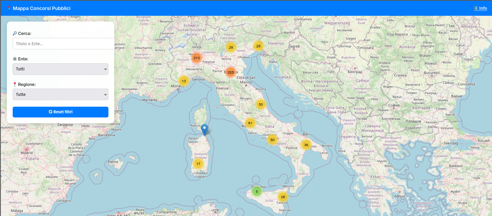

# 🗺️ Mappa Interattiva dei Concorsi Pubblici in Italia

Benvenuti in questo progetto open source che visualizza in tempo reale i concorsi pubblici attivi in Italia su una mappa interattiva basata su [Leaflet.js](https://leafletjs.com/).

> ⚠️ I dati sono raccolti dal sito pubblico [concorsipubblici.com](https://www.concorsipubblici.com) tramite scraping automatizzato, **esclusivamente a fini educativi e dimostrativi**.

---

## 🎯 Obiettivi del Progetto

- Automatizzare il recupero quotidiano dei concorsi pubblici per regione
- Geolocalizzare i bandi utilizzando API pubbliche
- Mostrare i concorsi su una mappa filtrabile per titolo, ente e regione
- Offrire uno strumento utile a cittadini e sviluppatori pubblici
- Dimostrare competenze in scraping, automazione, GIS e sviluppo web

---

## 📸 Anteprima

 <!-- Sostituisci con la tua immagine reale -->

---

## 🧠 Tecnologie Utilizzate

- `Python` (requests, BeautifulSoup)
- `Leaflet.js` per la mappa interattiva
- `OpenStreetMap` per le tile
- `GitHub Pages` per l’hosting statico
- `Crontab` e `pipeline.py` per l'automazione
- `Telegram` per notifiche automatiche (opzionale)

---

## ⚙️ Come funziona

1. `scarica_regioni.py` recupera i bandi da tutte le regioni
2. `geolocalizza.py` aggiunge latitudine/longitudine
3. `pipeline.py` esegue tutto e aggiorna i file JSON
4. `index.html` mostra i dati aggiornati sulla mappa
5. (opzionale) `notifica_telegram.py` invia una notifica a Telegram

---

## 🚀 Avvio rapido (per sviluppatori)

1. Clona il progetto:
   ```bash
   git clone https://github.com/tuo-utente/mappa-concorsi.git
   cd mappa-concorsi
   ```

2. Crea un virtualenv (opzionale) e installa le dipendenze:
   ```bash
   pip install -r requirements.txt
   ```

3. Esegui lo script completo:
   ```bash
   python3 pipeline.py
   ```

4. Apri `index.html` nel browser per visualizzare la mappa.

---

## 📡 Etica e Rispetto della Fonte

Questo progetto **non memorizza né redistribuisce** i dati di terze parti a scopo commerciale. Il contenuto proviene da `concorsipubblici.com`, un portale liberamente accessibile, **e viene usato esclusivamente per fini formativi, sperimentali e di trasparenza**.

Se rappresenti `concorsipubblici.com` e vuoi contattarci per chiarimenti o collaborazioni, scrivi pure nel repository.

---

## 💡 Possibili Estensioni Future

- Sistema di notifiche email personalizzate per i concorsi
- Mappa per dispositivi mobili
- Filtri avanzati per settore, titolo di studio, scadenza
- Traduzione in più lingue
- Versione dockerizzata

---

## 👨‍💻 Autore

**Angelo Massaro**  
Dottorando in Storia e appassionato di civic tech, trasparenza, open data e open source.  
📍 [digitaladriatic.eu](https://digitaladriatic.eu)

---

## 📄 Licenza

Questo progetto è distribuito sotto licenza MIT. I dati sono soggetti ai termini del sito `concorsipubblici.com`.
